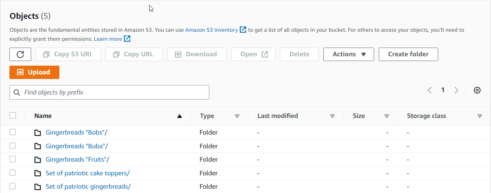
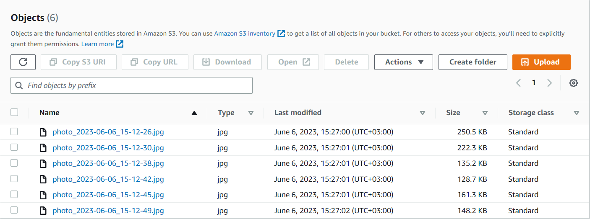

**This project is already in the development process!!**

-------------------------------------------------

# Online Shop - Java Spring Boot Project

Welcome to the Online Shop project! This e-commerce web application showcases my skills in Java and the Spring framework. The project utilizes Java Spring Boot as the backend framework and integrates with AWS S3 for secure storage, retrieval, and deletion of product images.

## About Me
I am a passionate developer with expertise in Java and a strong focus on backend development. With a solid understanding of the Spring framework, I have built this Online Shop project to demonstrate my proficiency in creating robust and scalable web applications.

Contacts:

[Link](https://www.linkedin.com/in/andrii-seleznov-32142721a/) LinkedIn

[Link](https://mail.google.com/mail/?view=cm&to=seleznov.andriy@gmail.com) Email
## Project Focus
The primary goal of this project is to highlight my skills in Java and Spring. By leveraging the power of Java Spring Boot, I want to implement essential backend functionalities such as user authentication, product management, and order processing. Also, I use AWS S3 for storing product images and in the future, I want to create a simple but good UI for this project using React.
## AWS S3 Integration
To ensure efficient image management, this Online Shop project integrates with AWS S3 (Simple Storage Service). By leveraging AWS S3, I have implemented secure storage, retrieval, and removal of product images. This integration allows for optimal image handling and delivery within the online shop.

## Limited Usage of React
While primarily focusing on Java and Spring, I have selectively utilized React for specific functionalities within the project. By integrating with React, I aim to demonstrate my ability to work with front-end technologies and create interactive features, complementing the robust backend built with Java Spring Boot.

## Project Status and Progress
The Online Shop project is - currently in progress, with some backend functionalities already implemented. Firstly, I decided to focus on the admin page. For example, was created main endpoints for manipulations with products(CRUD).
### Main operations with products:

#### Create product:

#### Read product by id:

#### Read all products:

#### Update product:

#### Delete product:

--------------------------------------------------------------
### Additional operations with product images

#### Add image for existing product:

#### Get all images for product:

#### Delete image:

The integration with AWS S3 for image storage and retrieval is also in place, ensuring efficient image management within the online shop.
#### Each product has his own folder where stored images for this product:

#### Where stored images for this product:

React has been used for specific functionality, enhancing the user experience while primarily emphasizing my Java and Spring expertise.
UI will be realized in the future!

## Next Steps
As the project progresses, I will continue to refine the backend features and further enhance the online shopping experience. Future updates will include additional functionalities such as:
- additional features for the admin page, such as sorting, product tracking, and order notifications.
- user authentication,
- order processing,
- order tracking,
- payment integration,
- UI

Thank you for your interest in my project. Feel free to explore the code and project structure. If you have any questions or suggestions, please don't hesitate to reach out!