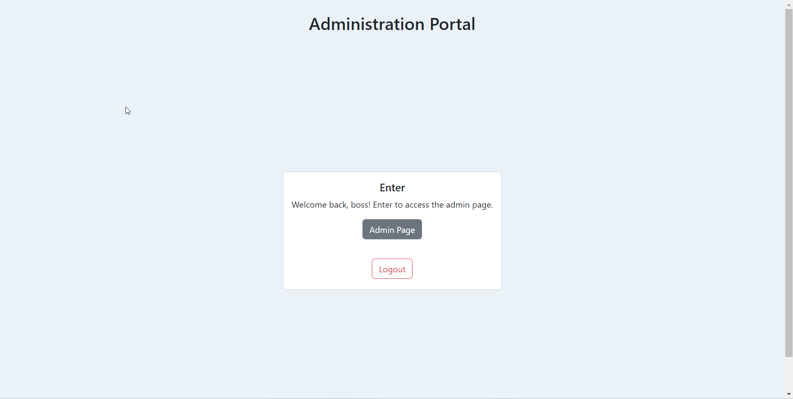
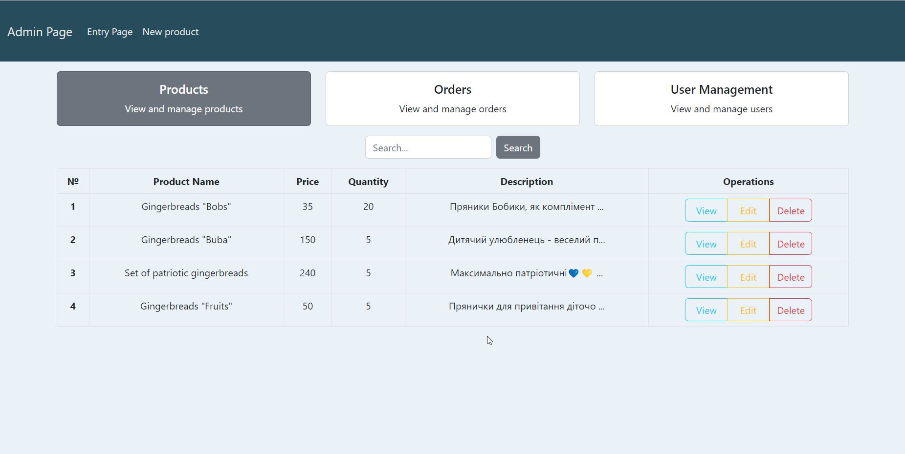
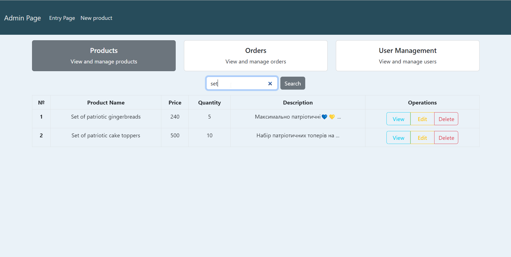
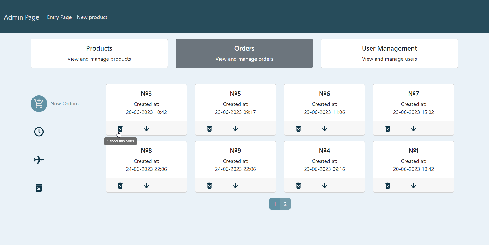

**This project is during the development process!!**

-------------------------------------------------

# Online Shop - Java Spring Boot Project

Welcome to the Online Shop project! This e-commerce web application showcases my skills in Java and the Spring framework, React.js and PostgreSQL. The project utilizes Java Spring Boot as the backend framework and integrates with AWS S3 for secure storage, retrieval, and deletion of product images.
## Great news!
I'm excited to share the latest updates in my app for small businesses. The project has undergone significant improvements, now all the examples featured in the app are real business owned by my friends. So don't worry, even if you don't want to hire me as a developer in your company, you can still enjoy something truly delicious when you purchase through this shop. So, if you're craving mouthwatering gingerbreads or other delightful treats, follow the link: https://www.instagram.com/naretin_pryanik/
and indulge yourself in a tasty shopping experience while supporting small businesses.
In my opinion, it's a win-win situation, where you get to satisfy your taste buds and help entrepreneurs thrive!
And after that, you can remember me and give me a chance to become part of your development team ;)

## Last updates:
Last updates were added to this project(new goes first), screenshots you can see below:
- created User Management
- created Order Manager
- created main operations with products

## About Me
I am a passionate developer with expertise in Java and a strong focus on backend development. With a solid understanding of the Spring framework, I have built this Online Shop project to demonstrate my proficiency in creating robust and scalable web applications.

Contacts:

[Link](https://www.linkedin.com/in/andrii-seleznov-32142721a/) LinkedIn

[Link](https://mail.google.com/mail/?view=cm&to=seleznov.andriy@gmail.com) Email
## Project Focus
The primary goal of this project is to highlight my skills in Java and Spring. By leveraging the power of Java Spring Boot, I want to implement essential backend functionalities such as user authentication, product management, and order processing. Also, I use AWS S3 for storing product images and React.js + Bootstrap for a simple but good UI.
## AWS S3 Integration
To ensure efficient image management, this Online Shop project integrates with AWS S3 (Simple Storage Service). By leveraging AWS S3, I have implemented secure storage, retrieval, and removal of product images. This integration allows for optimal image handling and delivery within the online shop.

## Usage of React
By integrating with React, I aim to demonstrate my ability to work with front-end technologies and create interactive features, complementing the robust backend built with Java Spring Boot.

## Administration portal.
### Enter page / Login page / Admin Page

#### Enter Page:

--------------------------------------------

#### Login Page:

----------------------------------------------

#### Enter Page after log-in:

-----------------------------------------------

#### Admin Page(products):

-----------------------------------------------

If you try to get access to the admin portal like a user...

You'll see this error:

### Main operations with products:

#### Create product:

--------------------------------------------------------------------------------------------------------------------------------------------------------------------------------------------------------------------------------------------------------------------

#### View product:

--------------------------------------------------------------------------------------------------------------------------------------------------------------------------------------------------------------------------------------------------------------------

#### Update product:

Admin can see all images in this window and can delete images when clicking on the "trash" icon.

At the end of updating the product, you should press the "Update Product" button.

--------------------------------------------------------------------------------------------------------------------------------------------------------------------------------------------------------------------------------------------------------------------

#### Delete product:

--------------------------------------------------------------------------------------------------------------------------------------------------------------------------------------------------------------------------------------------------------------------

#### Search products:

--------------------------------------------------------------------------------------------------------------------------------------------------------------------------------------------------------------------------------------------------------------------

The integration with AWS S3 for image storage and retrieval is also in place, ensuring efficient image management within the online shop.
#### Each product has its folder where stored images for this product are:

--------------------------------------------------------------------------------------------------

#### Where stored images for this product:

--------------------------------------------------------------------------------------------------
### Order Manager
All new orders can be viewed in the first category "New Orders":

If you have more than 8 orders, you can change the page to see other orders:

Also, you can change the order's status:

And the most important thing is detailed information about the order:

-----------------------------------------------

### User Management
All users can be viewed in the first filter 'All':

Change the filter option to 'Management' and you will see administrators only:

Change the filter option to 'Customers' and you will see users only:

On the left side of filtering options, you can see the button 'Create new administrator' because only the admin has permission to create a new admin:

when you click on this button - this form will be shown:

Also, each user has a role. If you want to change the role for any user you should select a new role from the dropdown menu and click the button 'Change Role':

If you want to update information about the user:

And you can delete the user by clicking on the button:

Then you'll see this confirmation window:

-------------------------------------------------------

## Next Steps
As the project progresses, I will continue to refine the backend features and further enhance the online shopping experience. Future updates will include additional functionalities such as:
- a mobile app for customers
- additional features for the admin page, such as operations with orders(order notifications)
- integration with Nova Post API
- payment integration

Thank you for your interest in my project. Feel free to explore the code and project structure. If you have any questions or suggestions, please don't hesitate to reach out!